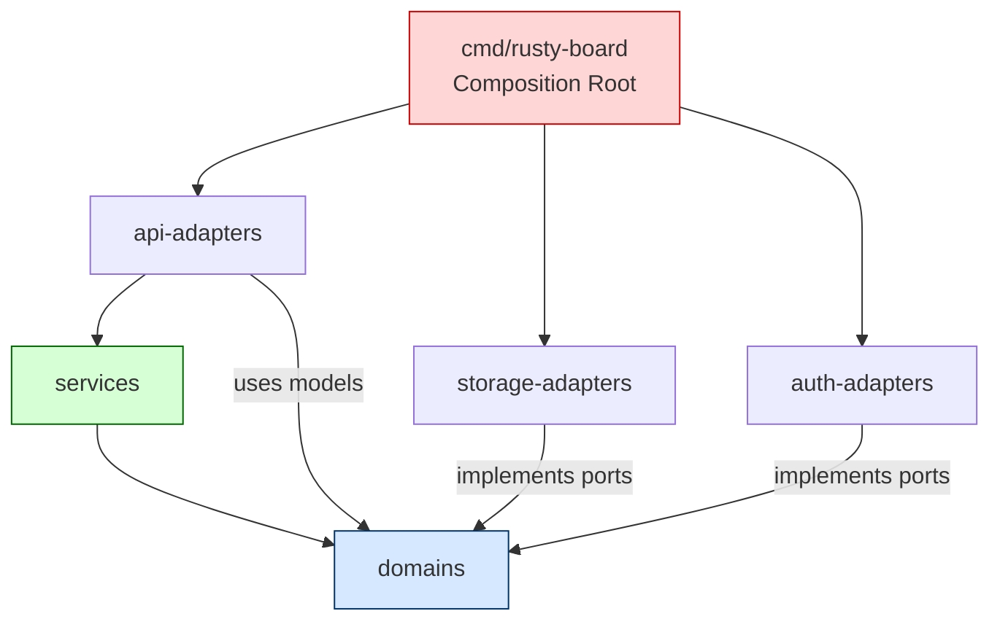
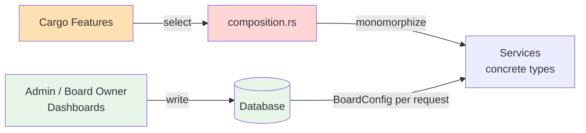
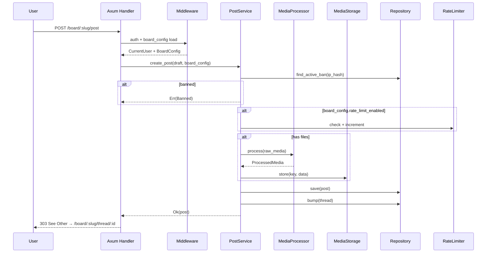

# ARCHITECTURE.md
# rusty-board — System Architecture

> **Master reference for all structural decisions. When in doubt about where something belongs, this document has the answer.**

---

## 1. Project Identity

**rusty-board** (codebase alias: iron-board) is a production-ready, anonymous imageboard engine written in Rust. It is designed for a 5–10 year maintenance horizon, prioritizing correctness, modularity, and operator control over cleverness or brevity.

Core character:
- Anonymous by default. No user accounts for posters.
- Ephemeral by design. Threads age out. Content is not permanent.
- Media-heavy. Images are first-class. Video and document previews are optional.
- Operator-controlled behavior. Every meaningful behavioral parameter is tunable per board through dashboards — no redeployment required.

---

## 2. The Foundational Principle

Everything in this architecture flows from one decision, stated once and enforced everywhere:

> **Adapter selection is a compile-time decision. Behavioral configuration is a runtime decision. These two concerns are permanently separated and must never be conflated.**

**Compile-time** means: which database engine, which web framework, which authentication mechanism, which media storage backend. These are resolved by Cargo feature flags. The compiler enforces that the selected implementation satisfies the port contract. After compilation, the wrong adapter literally does not exist in the binary. Cost: zero. Mechanism: Rust's trait system and monomorphization.

**Runtime** means: how a specific board behaves — its rate limits, spam thresholds, content rules, feature toggles, NSFW status. These are stored in the database as `BoardConfig`, loaded per request, and passed into service methods. Operators change them through dashboards. No recompile. No redeploy. Cost: one cached DB read per board.

The invariant this creates:

- Services never read `#[cfg(feature = "...")]` flags.
- Feature flags never appear inside service method bodies.
- `BoardConfig` is the only path from a dashboard control to service behavior.
- `Settings` contains only infrastructure configuration (URLs, secrets, ports). It never contains per-board behavioral parameters.

---

## 3. Architectural Style

**Ports & Adapters (Hexagonal Architecture)** with compile-time adapter selection.

Every external boundary — database, file storage, authentication, rate limiting, media processing — is represented as an async trait (a "port") defined in the innermost crate (`domains`). Concrete implementations ("adapters") live in adapter crates and implement those traits. The composition root (`composition.rs`) is the only place where concrete types are selected and wired together.

The dependency rule is strictly inward:

```
┌─────────────────────────────────────────────┐
│  cmd/rusty-board  (composition root)        │
│  Selects and wires concrete types.          │
│  The only file with #[cfg(feature)] branches│
└────────────────────┬────────────────────────┘
                     │ depends on
┌────────────────────▼────────────────────────┐
│  api-adapters                               │
│  HTTP transport layer (Axum / Actix / ...)  │
│  Routes, handlers, middleware, templates    │
└────────────────────┬────────────────────────┘
                     │ calls
┌────────────────────▼────────────────────────┐
│  services                                   │
│  Business logic. Generic over port traits.  │
│  Branches on BoardConfig, never on features │
└────────────────────┬────────────────────────┘
                     │ depends only on
┌────────────────────▼────────────────────────┐
│  domains                                    │
│  Models, port traits, errors, BoardConfig   │
│  No I/O. No frameworks. No async runtime.   │
└─────────────────────────────────────────────┘
                     ▲
   storage-adapters ─┤ implement ports
   auth-adapters    ─┤
   (feature-gated)   │
```

Concrete adapters depend inward on port traits. The core (`domains`, `services`) never depends outward on any adapter.

---

## 4. The Compile-time / Runtime Boundary in Full

```
╔══════════════════════════════════════════════════════════════╗
║  COMPILE-TIME — Cargo feature flags                         ║
║                                                              ║
║  Category        Options                                     ║
║  ─────────────── ───────────────────────────────────         ║
║  Web framework   web-axum | web-actix                        ║
║  Database        db-postgres | db-sqlite                     ║
║  Auth            auth-jwt | auth-cookie                      ║
║  Media storage   media-s3 | media-local                      ║
║  Media process   (always: images) + video + documents        ║
║  Rate limiting   redis (+ noop for dev)                      ║
║                                                              ║
║  Resolved by:    #[cfg(feature="...")] in composition.rs     ║
║  Mechanism:      Rust monomorphization — zero overhead       ║
╚══════════════════════════════════════════════════════════════╝

╔══════════════════════════════════════════════════════════════╗
║  RUNTIME — BoardConfig loaded from database                 ║
║                                                              ║
║  Content rules   bump_limit, max_files, max_file_size,       ║
║                  allowed_mimes, max_post_length              ║
║  Rate limiting   enabled, window_secs, posts_per_window      ║
║  Spam            enabled, score_threshold, duplicate_check   ║
║  Posting         forced_anon, allow_sage, allow_tripcodes,   ║
║                  captcha_required, nsfw                      ║
║  Future          search_enabled, archive_enabled,            ║
║                  federation_enabled                          ║
║                                                              ║
║  Resolved by:    BoardConfig read from DB, cached in-process ║
║  Managed via:    Admin dashboard, board owner dashboard      ║
║  Mechanism:      Struct field read — no allocation           ║
╚══════════════════════════════════════════════════════════════╝
```

---

## 5. Key Invariants

These are architectural laws, not guidelines. A pull request that violates any of them is rejected regardless of how well it works.

1. `domains` depends **only** on `std`, `chrono`, `serde`, `uuid`, `thiserror`. No I/O. No frameworks. No async runtime beyond trait signatures.
2. `services` depends **only** on `domains`. No `sqlx`, no `axum`, no `aws_sdk_s3`, no adapter crate of any kind.
3. All external boundaries are behind async port traits defined in `domains/ports.rs`.
4. Concrete adapter implementations are feature-gated in adapter crates.
5. `#[cfg(feature = "...")]` appears **only** in `composition.rs` and adapter crate modules. Never in `domains`, `services`, or `api-adapters/common/`.
6. Wiring of concrete types happens **only** in `composition.rs`.
7. Services never read feature flags. All behavioral branching in service code is driven by `BoardConfig`.
8. `BoardConfig` is the **only** path from dashboard UI to service behavior. No env vars, no globals, no feature flags inside service methods.
9. `unwrap()` and `expect()` are permitted only in `composition.rs` (startup failures are intentionally fatal) and in test fixtures. Never in service methods, handlers, or adapter implementations.
10. All port traits use native async (RPITIT, Rust 1.75+). The `async-trait` macro is not used anywhere in the codebase.
11. **`Role::User` accounts never touch the posting pipeline.** `Post`, `Thread`, `Attachment`, `Ban`, and `Flag` records have no user account reference. Posting is anonymous at the model level regardless of whether the poster holds an account.

---

## 6. Crate Structure & Responsibilities

### `domains` — The Innermost Core

**Depends on**: `std`, `chrono`, `serde`, `uuid`, `thiserror` only.

**Contains**:
- All domain models: `Board`, `Thread`, `Post`, `Attachment`, `Ban`, `Flag`, `User`, `Role`, `BoardConfig`, `AuditEntry`, `StaffRequest`
- All value objects: `BoardId`, `ThreadId`, `PostId`, `UserId`, `BanId`, `FlagId`, `StaffRequestId`, `IpHash`, `MediaKey`, `ContentHash`, `Slug`, `FileSizeKb`, `Page`, `Paginated<T>`
- All port traits: every external boundary as an async trait
- All domain errors: `DomainError` and its variants
- `BoardConfig`: the complete runtime behavior surface

**Never contains**: I/O, framework imports, `#[cfg(feature)]`, async runtime imports beyond what RPITIT needs.

### `services` — Business Logic

**Depends on**: `domains` only.

**Contains**:
- `BoardService<BR: BoardRepository>` — board CRUD, slug validation, config management
- `ThreadService<TR: ThreadRepository>` — create, bump, sticky/close, prune
- `PostService<PR, TR, BR, MS, RL, MP>` — validate, spam check, process media, insert, bump
- `ModerationService<BR, PR, TR, FR, AR, UR>` — ban, flag, delete, audit
- `UserService<UR: UserRepository, AP: AuthProvider>` — create moderator accounts, login
- `common/utils.rs` — slug generation, pagination math, quote parsing, spam heuristics, `now_utc()`
- Service-specific error enums

**Never contains**: `sqlx`, `axum`, `aws_sdk_s3`, `#[cfg(feature)]`, or any concrete adapter type.

**Behavioral branching**: All conditional logic driven by `BoardConfig` fields passed as parameters.

### `storage-adapters` — Persistence and Media

**Depends on**: `domains` ports only.

**Feature-gated modules**:
- `postgres/` (`db-postgres`) — `PgBoardRepository`, `PgThreadRepository`, `PgPostRepository`, `PgBanRepository`, `PgFlagRepository`, `PgAuditRepository`, `PgUserRepository`
- `sqlite/` (`db-sqlite`, v1.2+) — same repository set for SQLite
- `media/images.rs` (always) — `ImageMediaProcessor`: resize, EXIF strip, PNG compress
- `media/videos.rs` (`video`) — `VideoMediaProcessor`: ffmpeg-next keyframe extraction
- `media/documents.rs` (`documents`) — `DocumentMediaProcessor`: pdfium-render first page
- `media/s3.rs` (`media-s3`) — `S3MediaStorage`
- `media/local_fs.rs` (`media-local`) — `LocalFsMediaStorage`
- `redis/` (`redis`) — `RedisRateLimiter`
- `migrations/` — SQL migration files (shared across SQL adapters)

**Never contains**: Business logic, `BoardConfig` branching, HTTP handling.

### `auth-adapters` — Authentication

**Depends on**: `domains` ports only.

**Feature-gated modules**:
- `jwt_bearer/` (`auth-jwt`) — `JwtAuthProvider`: token create/verify + argon2 password hash/verify
- `cookie_session/` (`auth-cookie`, v1.1+) — `CookieAuthProvider<SR: SessionRepository>`: server-side sessions with CSRF double-submit protection
- `common/` — `Claims` struct, TTL helpers, argon2 parameters (shared, not feature-gated)

**Never contains**: Business logic, HTTP routing, `BoardConfig` access.

### `api-adapters` — HTTP Transport

**Depends on**: `domains`, `services` (generic types).

**Feature-gated modules**:
- `axum/` (`web-axum`) — `build_router()`, routes, handlers, middleware, error mapping, health, metrics, templates
- `actix/` (`web-actix`, v1.x+) — `build_app()`
- `common/` — `ApiError`, DTOs (`BoardCreate`, `PostDraft`, `BoardConfigUpdate`), pagination helpers (not feature-gated)

**Handlers are thin**: Extract → validate request format (not business rules) → call service → map error to `ApiError`. No business logic in handlers.

**Never contains**: SQL queries, storage details, `#[cfg(feature)]` in `common/`.

### `configs` — Infrastructure Settings

**Depends on**: `serde`, `config`, `dotenvy`.

**Contains**: `Settings` struct with feature-gated infrastructure fields: server address, database URL, Redis URL, JWT secret, S3 credentials, media path, argon2 parameters, JWT TTL, thumbnail dimensions, IP salt rotation period.

**Never contains**: `BoardConfig` fields. Per-board behavioral settings live in the database, not in `Settings`.

### `cmd/rusty-board` — Composition Root

**Depends on**: All crates (conditionally).

**Contains**:
- `main.rs` — load `Settings`, init tracing, call `compose()`, start server, graceful shutdown, log compiled features
- `composition.rs` — **the only file in the codebase with `#[cfg(feature)]` branches**. Constructs all concrete adapter types. Injects them into generic services. Returns the configured router/app.

**Never contains**: Business logic, storage implementations, direct SQL.

---

## 7. The Role & User Model

### Roles

`Role` is a domain enum in `domains/models.rs`:

```rust
pub enum Role {
    Admin,           // Full site access: CRUD boards, user management, moderate everywhere
    Janitor,         // Site-wide moderation: delete, ban, sticky, close, resolve flags on any board
    BoardOwner,      // Manages specific owned boards: config, volunteers, moderation of own boards
    BoardVolunteer,  // Board-scoped: can delete posts and issue bans on assigned boards only
    User,            // Registered account. No moderation powers. Can submit staff requests.
}
```

Anonymous posters have no role and no account. They are identified only by `IpHash` for the duration of the session. **`Role::User` accounts post anonymously** — a logged-in User is indistinguishable from an unauthenticated visitor at the posting layer. User accounts are a staff-pipeline concept only.

**Moderation is an action, not a role.** Any role with sufficient privilege on a given board can perform moderation actions (delete post/thread/upload, ban by IP/duration/scope, flag for elevated review). The permission methods on `CurrentUser` encode these distinctions:

- `is_admin()` — Admin only
- `can_moderate()` — Janitor or Admin (site-wide authority)  
- `can_delete()` — any of: BoardVolunteer, BoardOwner, Janitor, Admin
- `can_manage_board_config(board_id)` — Admin, or BoardOwner whose `owned_boards` contains `board_id`

### Board Ownership & Volunteers

Board ownership is a **relationship**, not a role. A `User` with `role = BoardOwner` can be designated as the owner of one or more boards. This is stored in a `board_owners` join table.

Board volunteers are assigned by board owners to help moderate specific boards. They are stored in `board_volunteers`. Volunteers can delete posts and issue bans on their assigned boards only — they cannot change board config.

Schema for board ownership:
```sql
-- V010__create_board_owners.sql
board_id UUID NOT NULL REFERENCES boards(id) ON DELETE CASCADE,
user_id  UUID NOT NULL REFERENCES users(id)  ON DELETE CASCADE,
assigned_at TIMESTAMPTZ NOT NULL DEFAULT now(),
PRIMARY KEY (board_id, user_id)
```

The `CurrentUser` context struct available in handlers contains:
```rust
pub struct CurrentUser {
    pub id:            UserId,
    pub role:          Role,
    pub owned_boards:  Vec<BoardId>,  // boards this user owns (populated from JWT claims)
}
```

Permission checks for `BoardConfig` updates verify that `current_user.owned_boards.contains(&board_id)` or `current_user.role == Role::Admin`.

---

## 8. BoardConfig — The Runtime Behavior Surface

`BoardConfig` is defined in `domains/models.rs`. It is the complete and authoritative contract between dashboard UI and service business logic. One row exists per board in `board_configs`, created automatically when a board is created.

```rust
pub struct BoardConfig {
    // Content rules
    pub bump_limit:             u32,          // default: 500
    pub max_files:              u8,           // default: 4
    pub max_file_size:          FileSizeKb,   // default: 10240 (10MB)
    pub allowed_mimes:          Vec<Mime>,    // default: jpeg, png, gif, webp
    pub max_post_length:        u32,          // default: 4000 chars

    // Rate limiting
    pub rate_limit_enabled:     bool,         // default: true
    pub rate_limit_window_secs: u32,          // default: 60
    pub rate_limit_posts:       u32,          // default: 3

    // Spam filtering
    pub spam_filter_enabled:    bool,         // default: true
    pub spam_score_threshold:   f32,          // default: 0.75
    pub duplicate_check:        bool,         // default: true

    // Posting behavior
    pub forced_anon:            bool,         // default: false
    pub allow_sage:             bool,         // default: true
    pub allow_tripcodes:        bool,         // default: false  (v1.1 adapter)
    pub captcha_required:       bool,         // default: false  (v1.1 adapter)
    pub nsfw:                   bool,         // default: false

    // Future capabilities (fields present now, adapters ship later)
    pub search_enabled:         bool,         // default: false  (v1.2)
    pub archive_enabled:        bool,         // default: false  (v1.2)
    pub federation_enabled:     bool,         // default: false  (v2.0)
}
```

**Caching**: `BoardConfig` is cached in-process with a 60-second TTL using a `DashMap<BoardId, (BoardConfig, Instant)>`. Cache is invalidated immediately on any `PUT /board/:slug/config` request. This is sufficient for v1.0. Multi-instance deployments accept up to 60 seconds of stale config — acceptable for behavioral toggles. If stricter consistency is required in the future, Redis pub/sub invalidation can be added without touching service code.

**Extending `BoardConfig`**: Adding a new behavioral toggle requires: (1) new field in `BoardConfig`, (2) new column in `board_configs` migration, (3) service branch reading the field, (4) dashboard UI control, (5) DTO update, (6) service unit test for both toggle states. See `CONVENTIONS.md` for the full checklist.

---

## 9. Service Generic Pattern

Services are generic over the port traits they depend on. The composition root provides the concrete types. Monomorphization happens at compile time.

```rust
pub struct PostService<PR, TR, BR, MS, RL, MP>
where
    PR: PostRepository,
    TR: ThreadRepository,
    BR: BanRepository,
    MS: MediaStorage,
    RL: RateLimiter,
    MP: MediaProcessor,
{
    post_repo:       PR,
    thread_repo:     TR,
    ban_repo:        BR,
    media_storage:   MS,
    rate_limiter:    RL,
    media_processor: MP,
}
```

When a service has more than 4 type parameters, define a `*Deps` type alias at the composition root to keep instantiation readable:

```rust
// In composition.rs — readable concrete alias
type AppPostService = PostService<
    PgPostRepository,
    PgThreadRepository,
    PgBanRepository,
    S3MediaStorage,
    RedisRateLimiter,
    ImageMediaProcessor,
>;
```

Service methods receive `BoardConfig` by reference. They branch on its fields. They never read feature flags.

```rust
impl<PR, TR, BR, MS, RL, MP> PostService<PR, TR, BR, MS, RL, MP>
where ...
{
    pub async fn create_post(
        &self,
        draft: PostDraft,
        board_config: &BoardConfig,
    ) -> Result<Post, PostError> {
        // Ban check — always runs
        if let Some(ban) = self.ban_repo.find_active_by_ip(&draft.ip_hash).await? {
            return Err(PostError::Banned { reason: ban.reason, expires_at: ban.expires_at });
        }

        // Rate limiting — controlled by BoardConfig
        if board_config.rate_limit_enabled {
            let key = RateLimitKey { ip_hash: draft.ip_hash.clone(), board_id: draft.board_id };
            match self.rate_limiter.check(&key).await? {
                RateLimitStatus::Exceeded { retry_after_secs } =>
                    return Err(PostError::RateLimited { retry_after_secs }),
                RateLimitStatus::Allowed { .. } => {
                    self.rate_limiter.increment(&key, board_config.rate_limit_window_secs).await?;
                }
            }
        }

        // Spam heuristics — controlled by BoardConfig
        if board_config.spam_filter_enabled {
            self.check_spam_heuristics(&draft, board_config).await?;
        }

        // Media processing — controlled by BoardConfig MIME whitelist
        let attachments = self.process_attachments(&draft.files, board_config).await?;

        // ... insert post, bump thread
    }
}
```

---

## 10. Composition Root Pattern

`composition.rs` is the most architecturally sensitive file in the codebase. It is the single point where compile-time decisions become runtime values.

```rust
pub async fn compose(settings: &Settings) -> Result<Router, anyhow::Error> {

    // ── Database ────────────────────────────────────────────────────────────
    #[cfg(feature = "db-postgres")]
    let pool = PgPool::connect(&settings.db_url).await
        .expect("Failed to connect to PostgreSQL");

    #[cfg(feature = "db-postgres")]
    let board_repo  = PgBoardRepository::new(pool.clone());
    #[cfg(feature = "db-postgres")]
    let thread_repo = PgThreadRepository::new(pool.clone());
    #[cfg(feature = "db-postgres")]
    let post_repo   = PgPostRepository::new(pool.clone());
    #[cfg(feature = "db-postgres")]
    let ban_repo    = PgBanRepository::new(pool.clone());
    #[cfg(feature = "db-postgres")]
    let flag_repo   = PgFlagRepository::new(pool.clone());
    #[cfg(feature = "db-postgres")]
    let audit_repo  = PgAuditRepository::new(pool.clone());
    #[cfg(feature = "db-postgres")]
    let user_repo   = PgUserRepository::new(pool.clone());

    // ── Media Storage ───────────────────────────────────────────────────────
    #[cfg(feature = "media-s3")]
    let media_storage = S3MediaStorage::new(&settings.s3)
        .expect("Failed to configure S3 media storage");
    #[cfg(feature = "media-local")]
    let media_storage = LocalFsMediaStorage::new(&settings.media_path)
        .expect("Failed to configure local media storage");

    // ── Media Processor (compile-time capability selection) ─────────────────
    #[cfg(all(feature = "video", feature = "documents"))]
    let media_processor = FullMediaProcessor::new(&settings.thumbnail);
    #[cfg(all(feature = "video", not(feature = "documents")))]
    let media_processor = VideoMediaProcessor::new(&settings.thumbnail);
    #[cfg(not(feature = "video"))]
    let media_processor = ImageMediaProcessor::new(&settings.thumbnail);

    // ── Auth ────────────────────────────────────────────────────────────────
    #[cfg(feature = "auth-jwt")]
    let auth_provider = JwtAuthProvider::new(&settings.jwt_secret, settings.jwt_ttl_secs)
        .expect("Failed to configure JWT auth provider");

    // ── Rate Limiter ────────────────────────────────────────────────────────
    #[cfg(feature = "redis")]
    let rate_limiter = RedisRateLimiter::new(&settings.redis_url).await
        .expect("Failed to connect to Redis");

    // ── BoardConfig Cache ───────────────────────────────────────────────────
    let config_cache = BoardConfigCache::new(Duration::from_secs(60));

    // ── Services (fully monomorphized after this point) ────────────────────
    let post_service = PostService::new(
        post_repo.clone(), thread_repo.clone(), ban_repo.clone(),
        media_storage.clone(), rate_limiter.clone(), media_processor,
    );
    let board_service    = BoardService::new(board_repo.clone(), config_cache.clone());
    let thread_service   = ThreadService::new(thread_repo.clone());
    let mod_service      = ModerationService::new(
        ban_repo, post_repo, thread_repo, flag_repo, audit_repo, user_repo.clone(),
    );
    let user_service     = UserService::new(user_repo, auth_provider.clone());

    // ── Router ──────────────────────────────────────────────────────────────
    #[cfg(feature = "web-axum")]
    let router = axum::build_router(
        post_service, board_service, thread_service, mod_service, user_service,
        auth_provider, config_cache, settings,
    );

    Ok(router)
}
```

---

## 11. Media Pipeline

The media pipeline is split across two ports: `MediaProcessor` (processing) and `MediaStorage` (persistence). These are separate concerns with different adapter axes.

```
PostService::create_post()
    │
    ├── for each uploaded file:
    │       │
    │       ▼
    │   MediaProcessor::process(RawMedia { filename, mime, data })
    │       │
    │       ├── [always]   images.rs  → validate MIME, strip EXIF, resize to 320px, oxipng compress
    │       ├── [+video]   videos.rs  → ffmpeg keyframe seek → PNG thumbnail
    │       └── [+docs]    documents.rs → pdfium first page → PNG thumbnail
    │       │
    │       └── returns ProcessedMedia { original, thumbnail, hash, size_kb }
    │
    └── MediaStorage::store(key, data)  →  S3 or LocalFs
```

`MediaProcessor` is selected at compile time based on features. `MediaStorage` is also selected at compile time. Both are ports — `PostService` sees only the traits.

**URL generation and TTL**: `MediaStorage::get_url()` accepts an explicit `ttl: Duration` parameter. S3 generates presigned URLs valid for the specified duration. Local filesystem generates static public paths (TTL is ignored). Callers (handlers rendering templates) use a configurable TTL from `Settings.media_url_ttl_secs`. The default is 86400 seconds (24 hours) for embedded media URLs.

---

## 12. Extension Points

### Adding a New Database Adapter

1. Add feature `db-surrealdb` to `storage-adapters/Cargo.toml`
2. Create `storage-adapters/src/surreal/` module
3. Implement all repository ports: `SurrealBoardRepository`, `SurrealThreadRepository`, etc.
4. Add `#[cfg(feature = "db-surrealdb")]` branch in `composition.rs`
5. Zero changes to `domains`, `services`, or `api-adapters`

### Adding a New Web Framework

1. Add feature `web-actix` to `api-adapters/Cargo.toml`
2. Create `api-adapters/src/actix/` mirroring the axum structure
3. Implement `build_app()` returning `actix_web::App`
4. Add `#[cfg(feature = "web-actix")]` branch in `composition.rs`
5. Zero changes to `domains` or `services`

### Adding a New Behavioral Toggle

1. Add field to `BoardConfig` in `domains/models.rs`
2. Add column to a new migration file
3. Add branch in the relevant service method
4. Add UI control to the relevant dashboard template
5. Add `BoardConfigUpdate` DTO field
6. Add service unit tests for both toggle states
7. Zero new ports, zero new adapters, zero recompile required for the behavioral change

### Adding a New Port (Future Capability)

1. Define the trait in `domains/ports.rs` with full method signatures and doc comments
2. Add entry to `PORTS.md`
3. Add `Noop` stub for testing
4. Add `mockall` mock generation
5. Add generic bound to the service that needs it
6. Implement the concrete adapter
7. Wire in `composition.rs`

See `PORTS.md` for the complete port registry and planned future ports.

---

## 13. v1.0 Technology Defaults

| Concern | Technology | Feature Flag | Notes |
|---------|-----------|-------------|-------|
| Web framework | Axum 0.7 + tower-http | `web-axum` | Default |
| Database | PostgreSQL 16 via sqlx 0.8 | `db-postgres` | Default |
| Rate limiting | Redis 7 via deadpool-redis | `redis` | Default |
| Auth | JWT (jsonwebtoken) + argon2id | `auth-jwt` | Default |
| Media storage | AWS S3 / MinIO | `media-s3` | Default |
| Media storage (alt) | Local filesystem | `media-local` | Dev/small deployments |
| Image processing | `image` + `oxipng` | always | Always compiled |
| Video processing | `ffmpeg-next` | `video` | Optional; Docker complexity |
| Document processing | `pdfium-render` | `documents` | Optional; licensing TBD |
| Templates | Askama 0.12 | always | Compile-time checked |
| Metrics | `prometheus-client` | always | |
| Logging | `tracing` + `tracing-subscriber` | always | JSON in prod |
| Config | `config` + `dotenvy` | always | |

---

## 14. File Structure

```
iron-board/
├── Cargo.toml                       # Workspace manifest: members, workspace.dependencies,
│                                    # resolver="2", top-level feature matrix
├── README.md
├── CHANGELOG.md
├── LICENSE
├── Makefile
├── Dockerfile
├── docker-compose.yml
├── docker-compose.override.yml      # Dev: cargo-watch hot-reload
├── .env.example
├── .gitignore
├── .dockerignore
│
├── docs/
│   ├── ARCHITECTURE.md              # This file — structural decisions
│   ├── DESIGN.md                    # Principles, patterns, trade-off rationale
│   ├── DECISIONS.md                 # Architecture Decision Records (ADRs)
│   ├── TECHNICALSPECS.md            # Dependencies, schema, endpoints, perf targets
│   ├── REQUIREMENTS.md              # Functional and non-functional requirements
│   ├── ROADMAP.md                   # Public-facing version roadmap
│   ├── CONVENTIONS.md               # Naming, error handling, testing, code style
│   ├── PORTS.md                     # Authoritative port trait registry
│   ├── SECURITY.md                  # Security model, reporting, known gaps
│   ├── contributing.md
│   ├── setup.md
│   ├── testing.md
│   ├── api.md
│   ├── performance.md
│   └── deployment.md
│
├── scripts/
│   ├── backup.sh
│   ├── restore.sh
│   ├── migrate.sh
│   └── deploy.sh
│
├── cmd/
│   └── rusty-board/
│       ├── Cargo.toml               # Feature matrix; conditional deps on all crates
│       └── src/
│           ├── main.rs              # Load Settings, init tracing, compose(), start server,
│           │                        # graceful shutdown (SIGTERM + ctrl-c), log features
│           └── composition.rs       # THE ONLY FILE with #[cfg(feature)] branches.
│                                    # Constructs all concrete types. Returns Router.
│
├── crates/
│   ├── domains/
│   │   ├── Cargo.toml               # ONLY: serde, chrono, uuid, thiserror
│   │   └── src/
│   │       ├── lib.rs
│   │       ├── models.rs            # All domain structs, enums, value objects, BoardConfig
│   │       ├── ports.rs             # All port traits (async, RPITIT, Send+Sync+'static)
│   │       └── errors.rs            # DomainError and variants
│   │
│   ├── services/
│   │   ├── Cargo.toml               # deps: domains, anyhow, thiserror, chrono, tracing
│   │   └── src/
│   │       ├── lib.rs
│   │       ├── board/
│   │       │   ├── mod.rs           # BoardService<BR: BoardRepository>
│   │       │   └── errors.rs        # BoardError
│   │       ├── thread/
│   │       │   ├── mod.rs           # ThreadService<TR: ThreadRepository>
│   │       │   └── errors.rs        # ThreadError
│   │       ├── post/
│   │       │   ├── mod.rs           # PostService<PR, TR, BR, MS, RL, MP>
│   │       │   └── errors.rs        # PostError
│   │       ├── moderation/
│   │       │   ├── mod.rs           # ModerationService<BR, PR, TR, FR, AR, UR>
│   │       │   └── errors.rs        # ModerationError
│   │       ├── user/
│   │       │   ├── mod.rs           # UserService<UR: UserRepository, AP: AuthProvider>
│   │       │   └── errors.rs        # UserError
│   │       └── common/
│   │           ├── utils.rs         # slug_validate, paginate, now_utc, quote_parse,
│   │           │                    # spam_score, ip_hash
│   │           └── errors.rs        # ServiceError (shared base)
│   │
│   ├── storage-adapters/
│   │   ├── Cargo.toml               # features: db-postgres, db-sqlite, media-s3,
│   │   │                            #   media-local, video, documents, redis
│   │   └── src/
│   │       ├── lib.rs
│   │       ├── postgres/            # feature: db-postgres
│   │       │   ├── mod.rs
│   │       │   ├── connection.rs    # PgPool from Settings
│   │       │   └── repositories/
│   │       │       ├── board_repository.rs
│   │       │       ├── thread_repository.rs
│   │       │       ├── post_repository.rs
│   │       │       ├── ban_repository.rs
│   │       │       ├── flag_repository.rs
│   │       │       ├── audit_repository.rs
│   │       │       ├── staff_message_repository.rs  # PgStaffMessageRepository (v1.1)
│   │       │       └── user_repository.rs
│   │       ├── sqlite/              # feature: db-sqlite (v1.2+)
│   │       │   └── repositories/    # SqliteBoardRepository, etc.
│   │       ├── media/
│   │       │   ├── mod.rs           # MediaProcessor facade + MediaProcessorConfig
│   │       │   ├── images.rs        # Always: image + oxipng, EXIF strip, resize
│   │       │   ├── videos.rs        # feature: video — ffmpeg-next
│   │       │   ├── documents.rs     # feature: documents — pdfium-render
│   │       │   ├── s3.rs            # feature: media-s3 — S3MediaStorage
│   │       │   └── local_fs.rs      # feature: media-local — LocalFsMediaStorage
│   │       ├── cache/
│   │       │   └── board_config.rs  # BoardConfigCache (DashMap + TTL)
│   │       ├── redis/               # feature: redis
│   │       │   ├── mod.rs           # RedisRateLimiter impl RateLimiter
│   │       │   └── connection.rs
│   │       ├── in_memory/           # no-dep adapters (v1.1+)
│   │       │   ├── mod.rs
│   │       │   ├── rate_limiter.rs  # InMemoryRateLimiter impl RateLimiter (DashMap sliding window)
│   │       │   └── session_repository.rs  # InMemorySessionRepository impl SessionRepository
│   │       ├── stubs/               # Noop adapters for integration tests — NoopStaffRequestRepository (pending Pg impl)
│   │       │   └── mod.rs           # NoopRateLimiter, NoopStaffRequestRepository, etc.
│   │       └── migrations/          # 13 consolidated final-state migrations. All have .down.sql.
│   │           │                    # All DDL uses IF NOT EXISTS for idempotency.
│   │           ├── 001_create_users.sql            # users; all 5 roles in CHECK from day 1
│   │           ├── 002_create_boards.sql           # boards + post_counter BIGINT
│   │           ├── 003_create_board_configs.sql    # board_configs + link_blacklist
│   │           ├── 004_create_board_ownership.sql  # board_owners + board_volunteers
│   │           ├── 005_create_threads.sql
│   │           ├── 006_create_posts.sql            # posts + post_number BIGINT
│   │           ├── 007_create_attachments.sql
│   │           ├── 008_create_bans.sql
│   │           ├── 009_create_flags.sql
│   │           ├── 010_create_audit_logs.sql
│   │           ├── 011_create_staff_requests.sql   # staff_requests + updated_at trigger
│   │           ├── 012_create_staff_messages.sql
│   │           └── 013_create_user_sessions.sql    # Cookie session auth (v1.1)
│   │
│   ├── auth-adapters/
│   │   ├── Cargo.toml               # features: auth-jwt, auth-cookie
│   │   └── src/
│   │       ├── lib.rs
│   │       ├── jwt_bearer/          # feature: auth-jwt
│   │       │   ├── mod.rs           # JwtAuthProvider impl AuthProvider
│   │       │   └── errors.rs
│   │       ├── cookie_session/      # feature: auth-cookie (v1.1+)
│   │       │   └── mod.rs
│   │       └── common/
│   │           ├── hashing.rs       # argon2id hash/verify (shared, not feature-gated)
│   │           └── utils.rs         # Claims struct, TTL helpers
│   │
│   ├── api-adapters/
│   │   ├── Cargo.toml               # features: web-axum, web-actix
│   │   └── src/
│   │       ├── lib.rs
│   │       ├── axum/                # feature: web-axum
│   │       │   ├── mod.rs           # build_router(...)  → axum::Router
│   │       │   ├── routes/
│   │       │   │   ├── board_routes.rs
│   │       │   │   ├── thread_routes.rs
│   │       │   │   ├── post_routes.rs
│   │       │   │   ├── auth_routes.rs
│   │       │   │   ├── admin_routes.rs
│   │       │   │   ├── moderation_routes.rs
│   │       │   │   └── board_owner_routes.rs
│   │       │   ├── handlers/
│   │       │   │   ├── board_handlers.rs
│   │       │   │   ├── thread_handlers.rs
│   │       │   │   ├── post_handlers.rs
│   │       │   │   ├── auth_handlers.rs
│   │       │   │   ├── admin_handlers.rs
│   │       │   │   ├── moderation_handlers.rs
│   │       │   │   └── board_owner_handlers.rs
│   │       │   ├── middleware/
│   │       │   │   ├── auth.rs          # JWT/cookie extract → CurrentUser; BoardOwnerUser, VolunteerUser extractors (v1.1)
│   │       │   │   ├── accept.rs        # WantsJson extractor (FromRequestParts)
│   │       │   │   ├── board_config.rs  # Load + cache BoardConfig for request
│   │       │   │   ├── cors.rs
│   │       │   │   ├── csrf.rs          # v1.1+ for cookie auth
│   │       │   │   └── request_id.rs
│   │       │   ├── error.rs
│   │       │   ├── health.rs
│   │       │   ├── metrics.rs
│   │       │   └── templates.rs
│   │       ├── actix/               # feature: web-actix (v1.x+)
│   │       │   └── mod.rs
│   │       └── common/              # NOT feature-gated
│   │           ├── errors.rs        # ApiError
│   │           ├── dtos.rs          # BoardCreate, PostDraft, BoardConfigUpdate, etc.
│   │           └── pagination.rs
│   │
│   └── configs/
│       ├── Cargo.toml
│       └── src/
│           ├── lib.rs               # Settings struct (infrastructure only)
│           └── defaults.rs          # Feature-aware infrastructure defaults
│
├── templates/                # Root copy kept in sync with crates/api-adapters/templates/
│   ├── base.html
│   ├── board.html
│   ├── thread.html
│   ├── catalog.html
│   ├── overboard.html
│   ├── admin_dashboard.html
│   ├── janitor_dashboard.html          # Janitor (global moderator) dashboard
│   ├── board_owner_top_dashboard.html  # Board owner landing — lists owned boards
│   ├── board_owner_dashboard.html      # Per-board config & volunteer management
│   ├── volunteer_dashboard.html        # Board volunteer dashboard
│   ├── login.html
│   └── components/
│       ├── post.html
│       ├── thread_preview.html
│       ├── pagination.html
│       ├── flash.html
│       └── quote.html
│
├── static/
│   ├── css/
│   │   ├── style.css
│   │   ├── dark_style.css
│   │   └── yotsuba.css
│   └── js/
│       ├── app.js
│       ├── theme.js.example
│       └── custom_scripts.js.example
│
└── tests/
    ├── integration/
    │   ├── api_auth.rs
    │   ├── api_board.rs
    │   ├── api_post.rs
    │   ├── api_moderation.rs
    │   ├── api_board_owner.rs
    │   └── media_upload.rs
    ├── adapter_contracts/           # Verify each adapter actually satisfies port contract
    │   ├── board_repository.rs      # Contract tests run against real DB via testcontainers
    │   ├── post_repository.rs
    │   ├── rate_limiter.rs
    │   └── media_storage.rs
    ├── unit/
    │   ├── domains_models.rs
    │   ├── domains_board_config.rs
    │   ├── services_board.rs
    │   ├── services_thread.rs
    │   ├── services_post.rs
    │   ├── services_moderation.rs
    │   └── auth_jwt.rs
    ├── fixtures/
    │   ├── mod.rs
    │   ├── users.rs
    │   ├── boards.rs
    │   ├── board_configs.rs         # Permissive, strict, NSFW, etc.
    │   ├── threads.rs
    │   ├── posts.rs
    │   ├── sample.jpg
    │   ├── sample.mp4
    │   └── sample.pdf
    └── snapshots/
        └── templates/
            ├── board_snapshot.insta
            ├── thread_snapshot.insta
            └── board_owner_dashboard_snapshot.insta
```

---

## 15. Mermaid Diagrams

### Layer Dependencies



### Compile-time vs Runtime



### Request Flow — New Post


